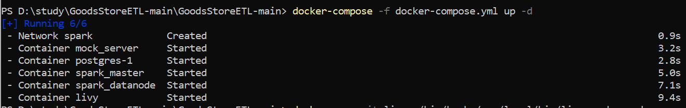
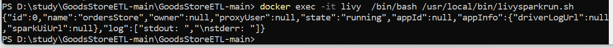

# GoodsStoreETL

<b4> Data Processing </b4> 
  1) Tools used for processing are Apache spark for processing, postgres for storage, Apache livy for running spark job using rest api. 
  2) Fetched data from postgres and restapi andcreated staging.orders table by joining the two dataset based on 'item_id'  
  3) Data is populated in staging.orders table ( same postgres DB as items table). On top of this table we can write our queries.  
  

<b4> Steps to run project </b4>
  1) Download project into your local system.  
  2) From root folder run below dockercommand (5 containers and 1 bridge will be created).   <b> docker-compose -f docker-compose.yml up -d </b>      
  4) Run below command to trigger job.   <b> docker exec -it livy  /bin/bash /usr/local/bin/livysparkrun.sh </b>      
  5) We can check data in <b> select * from staging.orders </b> table .  
    
  
