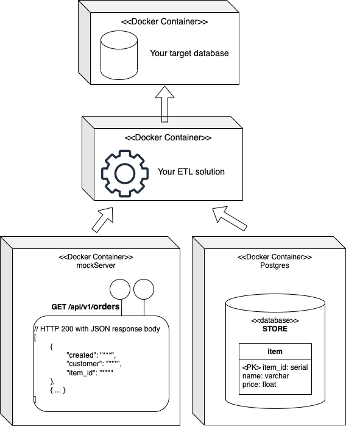

# Data Engineer Challenge
Thank you for considering FactoryPal, we hope you enjoy the coding challenge.

Imagine you are a Data Engineer in a successful online sporting goods store.

You've been asked to build a corporate data warehouse to manage the company's historical data that will provide insight into the company's operations, including reports and ad-hoc analysis.

* design an ETL process that will extract data from two services (the shop store with catalogue of sport items, RES API with customer orders )
* design a database to store aggregated data from the sources mentioned above.

In the project, we have prepared a data set for your solution (see the section [Source Data](#source-data)). For the evaluation, we use a different dataset.

## Requirements
* the solution must run on a local machine using docker and docker-compose.
* The selection of technologies is up to you (for ETL and target DB).
* describe your solution. Provide a guide on how to run the application locally.

## Bonus
* test coverage

## Source Data
We have prepared a simplistic dataset for the solution. Please execute the `docker compose up` from your root folder to start the data source services.



### 1) Store Items
* Connection details (DB, host, port, database, user, password) = (Postgres, localhost, 5432, store, etl_client, etl_client_pwd).
* DB model and datased are created by [init.sql](sourcedata/database/init.sql)
* Please note, that the column department is an enumerated type with fixed set of values.
```sql
-- connect with
-- jdbc:postgresql://localhost:5432/store?user=etl_client&password=etl_client_pwd
select * from store.public.item
```
| item\_id | name | price | department |
| :--- | :--- | :--- | :--- |
| 1 | Favorit Aviator | 2500 | BIKE |
| 2 | Favorit Cronos  | 2200 | BIKE |
| 3 | Ghost Lector Advanced | 4000 | BIKE |
| 4 | Husky Bonelli 3 | 1200 | CAMPING |
| 5 | Coleman BlackOut 4 | 1300 | CAMPING |
| 6 | Toy Machine Monster Board | 108 | SKATEBOARDING |
| 7 | Element Selection Board | 104 | SKATEBOARDING |


### 2) Customer Orders
Implemented by using [MockServer](https://www.mock-server.com/#what-is-mockserver). Api defined in [initializerJson.json](./sourcedata/api/initializerJson.json)
```http request
GET http://localhost:1080/api/v1/orders
```
```json
// HTTP 200 with JSON response body
[
  {"created": "2022-02-14 00:14:39.000000", "customer": "customer1@email.cze", "item_id": 1},
  {"created": "2022-06-14 10:15:42.000000", "customer": "customer1@email.cze", "item_id": 5},
  {"created": "2022-02-05 13:16:10.000000", "customer": "customer2@email.cze", "item_id": 4},
  {"created": "2022-02-05 13:16:08.000000", "customer": "customer2@email.cze", "item_id": 5},
  {"created": "2021-02-14 11:17:54.000000", "customer": "customer3@email.deu", "item_id": 3},
  {"created": "2021-03-14 10:18:21.000000", "customer": "customer4@email.fra", "item_id": 5}
]
```
